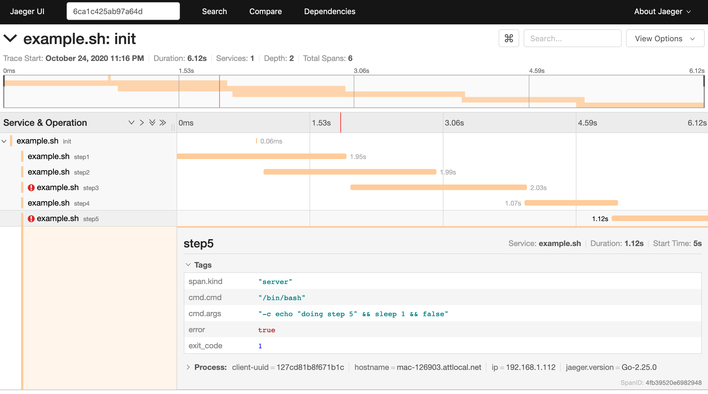

[](https://builds.sr.ht/~retzkek/pfeil/?)

# Pfeil

Pfeil is a simple tool to report an [opentracing](http://opentracing.io) span to
a [jaeger](https://www.jaegertracing.io) server from the command line, useful
for tracing shell scripts or external processes that can't be directly
instrumented. 

To record a child span, set the extracted parent trace ID (`uber-trace-id`) in
environment variable `TRACE_ID`.

The start time to report for the span will default to now, unless `TRACE_START`
is defined in Unix `date` format.

Pfeil can wrap another command, piping stdin, stdout, and sterr, and recording
the exit code (setting error=true if nonzero) in the span.

## Installation

With [Go](https://golang.org):

``` shell
go get git.sr.ht/~retzkek/pfeil
```

Binary artifacts for linux/amd64 from the latest build may be available on
[sourcehut](https://builds.sr.ht/~retzkek/pfeil).

## Running

 ``` shell
 pfeil [OPTS] OPERATION [CMD [ARGS...]]
 ```

A service name must be set via `-s/--service` option or `JAEGER_SERVICE_NAME`.
The span operation name must be provided as the `OPERATION` argument. If the
optional `CMD` and `ARGS` arguments are provided, `CMD` will be run with `ARGS`
in a subprocess, with stdin, stout, and stderr piped through. The exit code will
be added as tag exit_code, if it's nonzero then "error=true" will also be set.

### Flags

* `-h/--help` command help
* `-v/--verbose` verbose logging (default: `false`)
* `-y/--sample` always sample new trace (equivalent to `JAEGER_SAMPLER_TYPE=const` and
  `JAEGER_SAMPLER_PARAM=1`, default: `false`)
* `-n/--nosample` never sample new trace (overrides `-y`, sets `JAEGER_SAMPLER_PARAM=0`,
  default: `false`)
* `-s/--service string` service name (overrides `JAEGER_SERVICE_NAME`)
* `-t/--tag strings` tags to include in span, as "key=value". Multiple tags can
  be specified comma-separated, i.e. `-t k1=v1,k2=v2`, or the option can be
  repeated, i.e. `-t k1=v1 -t k2=v2`.

### Environment

* `TRACE_ID` extracted `uber-trace-id` (see below for example extraction)
* `TRACE_START` optional start time for trace in Unix `date` format (e.g. `Thu
  Oct 22 16:06:24 EDT 2020`)
* `JAEGER_SERVICE_NAME` The service name (overriden by -svc).
* `JAEGER_AGENT_HOST` The hostname for communicating with agent via UDP (default localhost).
* `JAEGER_AGENT_PORT` The port for communicating with agent via UDP (default 6831).
* `JAEGER_ENDPOINT` The HTTP endpoint for sending spans directly to a collector,
  e.g. http://jaeger-collector:14268/api/traces. If specified, the agent
  host/port are ignored.
* `JAEGER_SAMPLER_TYPE` The sampler type: remote, const, probabilistic,
  ratelimiting (default remote). See -y and -n options to conveniently set const
  sampling.
* `JAEGER_SAMPLER_PARAM` The sampler parameter (number).
* `JAEGER_SAMPLING_ENDPOINT` The URL for the sampling configuration server when
  using sampler type remote (default http://127.0.0.1:5778/sampling).

See [Jaeger client](https://github.com/jaegertracing/jaeger-client-go)
documentation for a complete list of environment variables to control the client
behavior.

## Example usage

``` sh
export JAEGER_ENDPOINT="http://my-jaeger-collector:14268/api/traces"
export JAEGER_SERVICE_NAME="my_script"
export TRACE_ID="7d7e22c6f96e391:b3185835b0e579c7:0:1" # we extracted this from some parent process
export TRACE_START=`date`
command_1
pfeil command_1
export TRACE_START=`date`
command_2
pfeil -v -t foo=bar -t exit_code=$? command_2
export TRACE_START=`date`
pfeil command_3 -- ls -l *.go
```

Output: 

```
07d7e22c6f96e391:615d621187660d87:b3185835b0e579c7:1
2020/10/22 16:13:19 pfeil: found TRACE_ID 7d7e22c6f96e391:b3185835b0e579c7:0:1
2020/10/22 16:13:19 pfeil: found TRACE_START Thu Oct 22 16:06:24 EDT 2020
2020/10/22 16:13:19 pfeil: started span 07d7e22c6f96e391:7f6e9f9bd9baf554:b3185835b0e579c7:1
2020/10/22 16:13:19 pfeil: setting tag foo to bar
2020/10/22 16:13:19 pfeil: setting tag exit_code to 0
07d7e22c6f96e391:7f6e9f9bd9baf554:b3185835b0e579c7:1
-rw-r--r--  1 kretzke  staff  7340 Oct 22 16:13 main.go
07d7e22c6f96e391:7cc5852d0146f03f:b3185835b0e579c7:1
```

See [example.sh](./example.sh) for a complete example shell script, including
child spans and capturing exit codes and error tags. Example trace:



## Extracting a trace id

Example in Python:

``` python
import jaeger_client
config={
    'sampler': {
        'type': 'const',
        'param': 1,
    },
}
t=jaeger_client.Config(config=config,service_name='test').initialize_tracer()
span=t.start_span('parent')
data={}
t.inject(span.context, 'text_map', data)
# data = {'uber-trace-id': '7d7e22c6f96e391:b3185835b0e579c7:0:1'}
print(data['uber-trace-id'])
span.finish()
```
